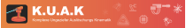

<!-- LTeX: language=de-DE -->



<div align="center">
    <h2>
        K.U.A.K.
    </h2>
</div>

<div align="center">
  <h2>
    Komplexe Ungeziefer Auslöschungs Kinematik
  </h2>
</div>

<div align="center">
    
    
    
</div>

Vortrag und schriftliche Abgabe, die im Rahmen der Vorlesung "Robotik" im 6.
Theorie Semester an der DHBW im Studiengang Informatik gemacht wurden.
Die Abkürzung K.U.A.K bedeutet ausgeschrieben: "Komplexe Ungeziefer Auslöschungs Kinematik"
und ist ein Wortspiel mit dem Firmennamen "Kuka" einem deutschen Hersteller von
Robotern.

Die Autoren erheben keinerlei Anspruch auf den Namen "Kuka" und es besteht auch
keine Verbindung zu besagter Firma. Motivation für das Wortspiel waren die
vielen Referenzen auf die Firma die während der Vorlesung gefallen sind.

## Bibtex Referenz

```
@techreport{KUAKVogelMüller2025,
  title       = "KUAK",
  author      = "Sven Vogel, Felix L. Müller",
  institution = "Cooperative State University Baden Württemberg",
  address     = "Baden-Württemberg, Germany",
  year        = 2025,
  month       = march
}
```
